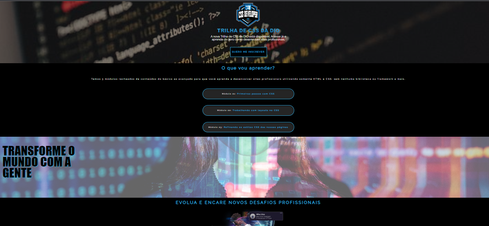

# Desafio 01: Criando sua primeira Landing Page com HTML e CSS 

## Participação do bootcamp NTT Data Developer da DIO

O objetivo deste projeto é aplicar os conhecimentos das ferramentas e elementos CSS adquiridos durante o curso.

Tive o oportunidade de desenvolver neste projeto:

- Conceito de imagens
- Dimensionamento de textos
- Percepção de imagens e cores
- Diagramação dos textos
- Animação simples

---

:books: ## Tecnologias

- HTML
- CSS
- Figma
- Ferramentas do desenvolvedor (Google Chrome)

### Para conhecer a plataforma da DIO clique abaixo:

